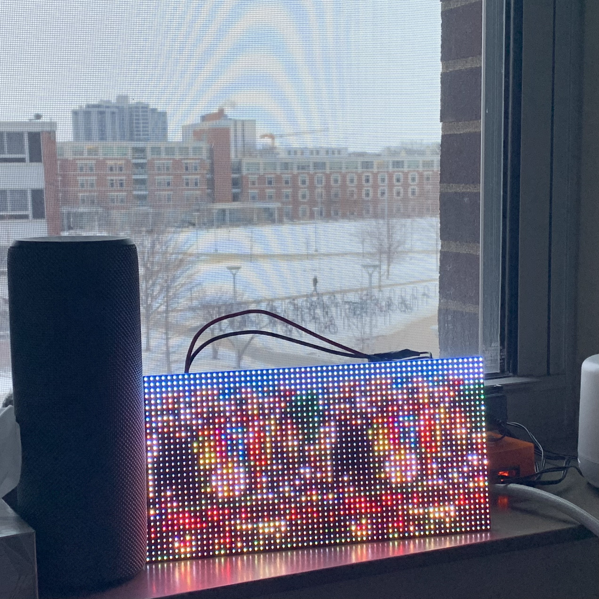
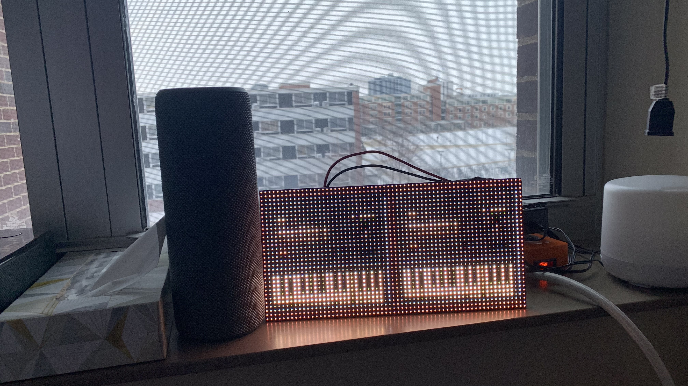
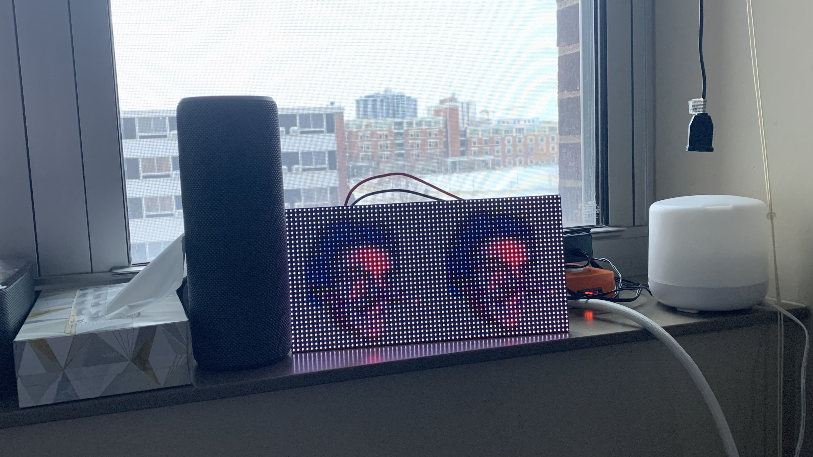
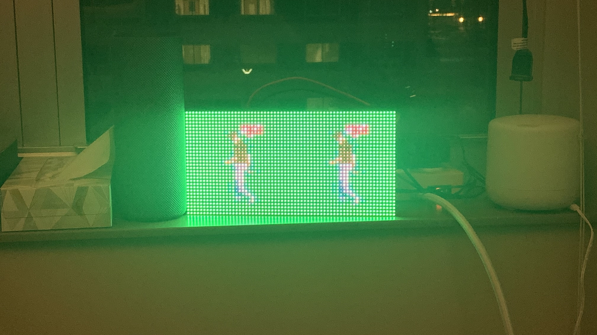

# spotilight
This code drives a 64x32 LED matrix on a pi to display album art of the currently-playing Spotify song. Here are some photos of it in action:

 
 
 
 

This is a WIP.
TODO:
- Bigger LED matrix!
- Less flicker -- move to ESP32 board?
- Cleanup code
